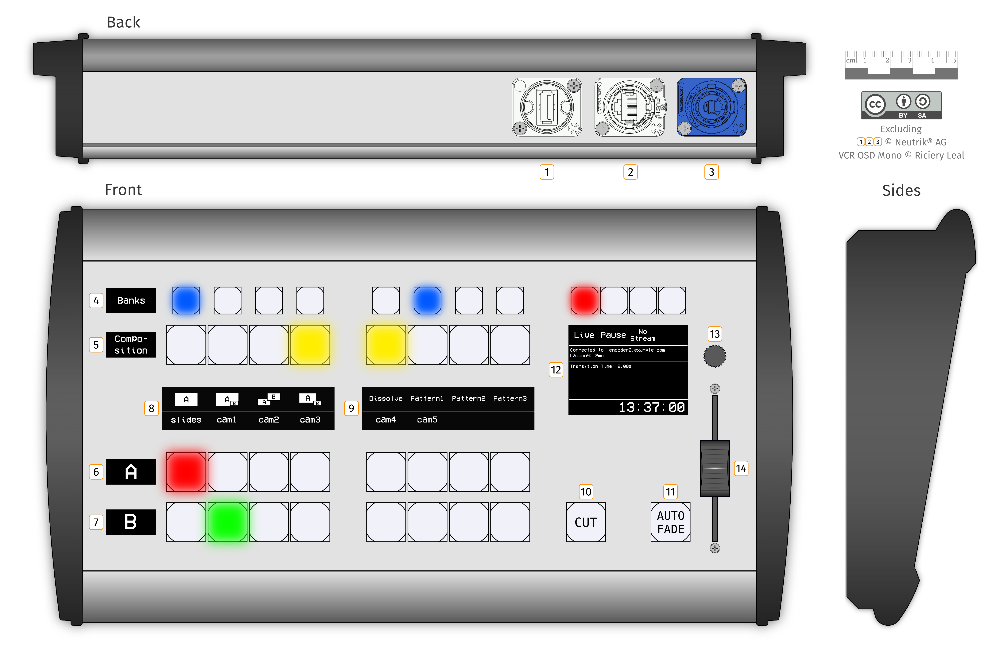

# Voctomix Controller Mockup

This is a mockup design for an universal hardware controller that could work with [voctomix](https://github.com/voc/voctomix).  
It is only a concept and I'm happy about feedback. There's also a little bit of unused space available on the front-plate for new feature ideas.  
You can find a real world picture of every component by following the matching links in the Bill of Materials below.

| Element | Component (Group) | Description / Use Cases |
|:----:|---|---|
| `1`  | USB socket | 1. configuration (serial console or via config file on usb stick, for e.g. connection parameters to voctocore (ip, port, ..)) 2. Human Input Device simulation for voctogui 3. firmware update |
| `2`  | RJ45 socket | sending commands to voctocore via ethernet |
| `3`  | power socket | power supply |
| `4`  | bank selection buttons | solution for the limited amount of buttons (composition/a/b-source). switches between different "banks" of button configurations. more explanation below at "Features"  |
| `5`  | composition mode selection buttons | selectors for the available composition modes (fullscreen/picture-in-picture/side-by-side equal/side-by-side preview) and transition modes (dissolve/patterns) (currently not implemented in voctomix) |
| `6`  | `A` source selection buttons | could also be `program` as it is on the atem broadcast panel |
| `7`  | `B` source selection buttons | could also be `preview` as it is on the atem broadcast panel |
| `8`, `9` | - | displays for the source/composition/transition buttons |
| `10` | take button | 1/2 buttons without dynamic function assignment (because of lacking display). function should be self-explaning. |
| `11` | auto button | 2/2 buttons without dynamic function assignment (because of lacking display). triggers an auto transition effect. |
| `12` | main display | for general information and for live/pause/"no stream" button group |
| `13` | rotary push button | for navigating and input on the main display (configuration like brightness of leds or display backlight) |
| `14` | fader | input control for e.g. dissolve or any pattern effects (currently not implemented in voctomix) |

## Features (-ideas)

1. all external connections are secured against accidental unplugging
2. flexibility
    1. the function of every button (group) is configurable due to the associated displays (except of the take button, which should be useful in any configuration). there aren't any fixed markings on the controllers case.
    2. All buttons are RGB illuminated. Colors are useful for indication of button groups. Thus buttons are re-groupable by configuration.
3. usability / ergonomics
    1. pictograms of composition / transition modes on the displays.
    2. buttons are grouped by four, most people mainly use only four fingers of each hand for typing. these fingers can remain on often used buttons which allows fast and blind selections.
    3. the take button is in reach to the little finger of the right hand but there's also enough space for the right hand to remain directly on the take button
    4. the groups can be blindly feeled since they're separated a little bit.
    5. similar structure and haptics (same push buttons!) like most of the commercially available video mixers (e.g. like the ATEM 1 M/E Broadcast Panel). since most of the video mixers on chaos events are familiar with such a hardware mixer they should quickly find out how to interact with this controller
    6. everything except of the fader and the rotary controller is illuminated (displays have a backlight).
4. 32 (4x8) input selectors, 16 (4x4) composition and 16 (4x4) transition selectors due to the "banks" buttons.
Operation: Each of the four available banks has different inputs / compositions / transitions assigned. Navigation through these banks is possible by selecting another bank.
Downside: switching between banks may be confusing as the current selected button disappears. Could be circumvented by 1. putting the most often used inputs / compositions / transitions on the first bank and 2. blink the led of the to the current selection associated bank
This is a advanced feature and may not be useful for 99% of the use cases of this controller. It is just there for flexibility gains.
5. self-configuring. since voctocore already offers to get all available inputs with their associated names (cam1, ...) the content of same of the displays can be obtained already automatically. This could be extended so that the only configuration on the panel itself are the connection parameters to voctocore.

## Bill of Materials

| Element | Description | Link |
|:----:|---|---|
| `1`  | Neutrik NAUSB-W Reversible USB 2.0 gender changer (type A and B), Nickel D-housing | <http://www.neutrik.com/en/multimedia/usb/nausb-w> |
| `2`  | Neutrik etherCON NE8FDP RJ45 feedthrough receptacle | <http://www.neutrik.com/en/data/ethercon/d-series/ne8fdp> |
| `3`  | Neutrik powerCON NAC3MPA-1 Chassis connector, power-in, 3/16" flat tab terminals, blue | <http://www.neutrik.com/en/powercon-20a/powercon-20-a/nac3mpa-1> |
| `4`, `5`, `6`, `7` | OLED Display 0.96" 128x64 White on Black | <http://www.buydisplay.com/default/datasheet-128x64-oled-module-spi-0-96-inch-graphic-displays-white-on-black> |
| `8`, `9`  | OLED Display 3.2" 256x64 White on Black | <http://www.buydisplay.com/default/serial-3-2-inch-display-arduino-256x64-oled-screen-module-white-on-black> |
| `10` and every other button | Illuminated (RGB) tactile push button (17,4mm / 12mm) | <http://www.lakeview.com.hk/up_pic/201731613595571016.pdf> |
| `12`  | OLED Display 2.42" 128x64 White on Black | <https://de.aliexpress.com/item/2-4-inch-24PIN-SPI-White-Yellow-COG-OLED-Display-Screen-SPD0301-Drive-IC-128-64/32842719317.html> |
| `13`  | Rotary encoder with switch | <https://de.aliexpress.com/item/5PCS-LOT-Original-Rotary-encoder-code-switch-EC11-digital-potentiometer-with-switch-5Pin-handle-length-15mm/32685033240.html> |
| `14`  | 60mm Slide Potentiometer | <http://www.bourns.com/docs/Product-Datasheets/pta.pdf> |
| Case | Bopla Alu-Topline ATPH 1850-0300 | <https://www.bopla.de/en/enclosure-technology/product/alu-topline.html> |

## License

[Attribution-ShareAlike 3.0 Unported (CC BY-SA 3.0)](http://creativecommons.org/licenses/by-sa/3.0/)

Excluding:  
`1` `2` `3` © Neutrik® AG  
VCR OSD Mono © Riciery Leal
